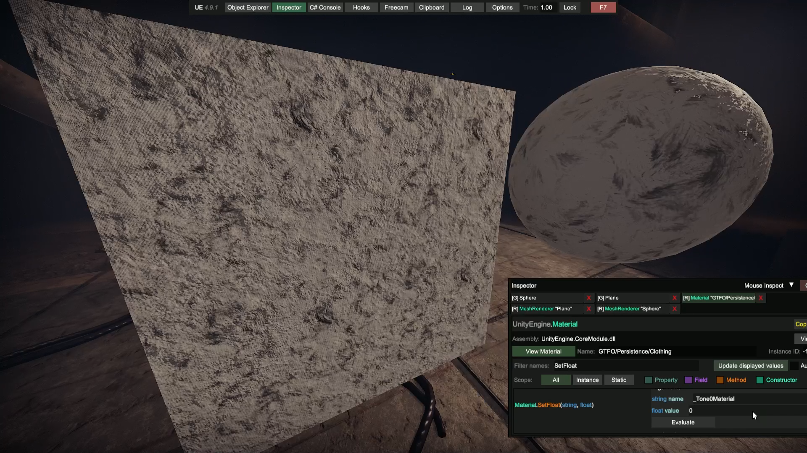
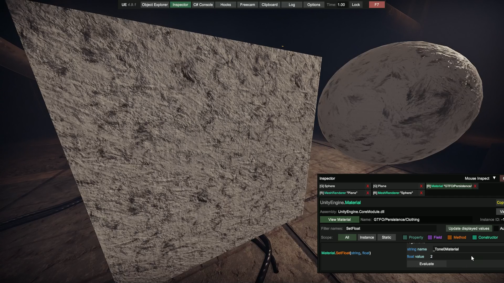
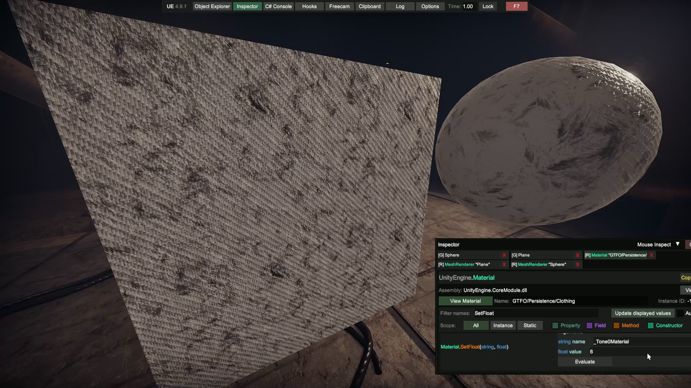
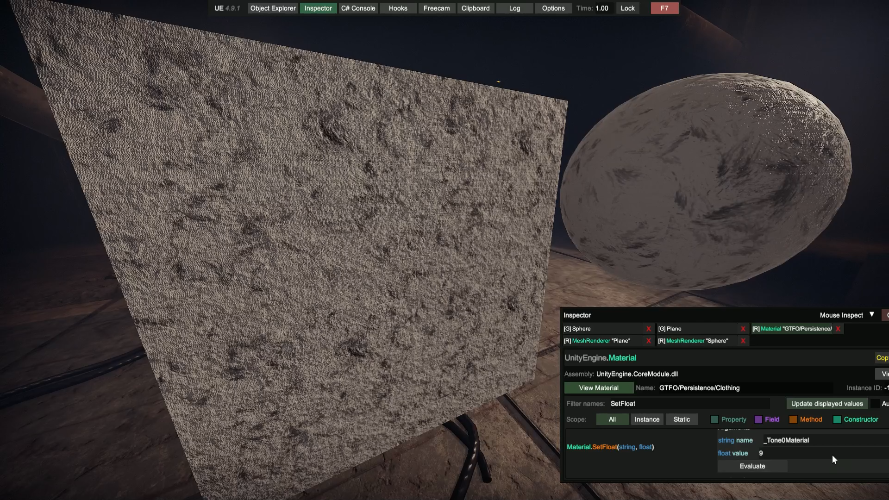
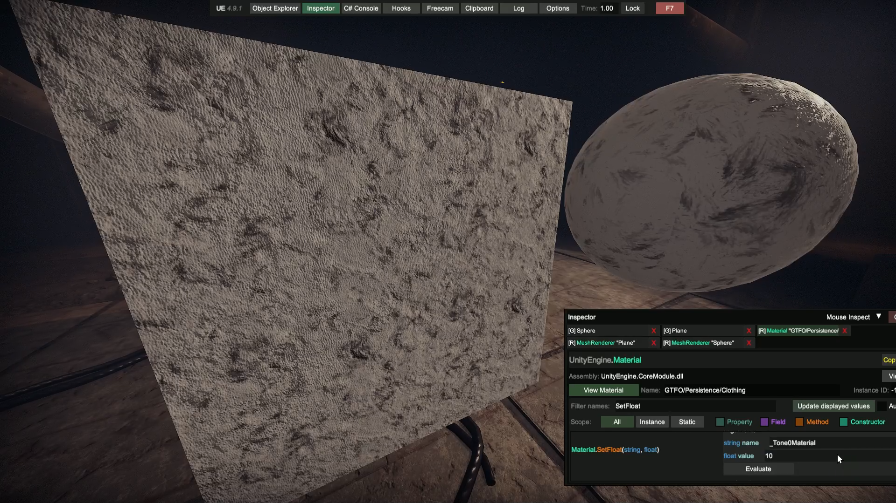
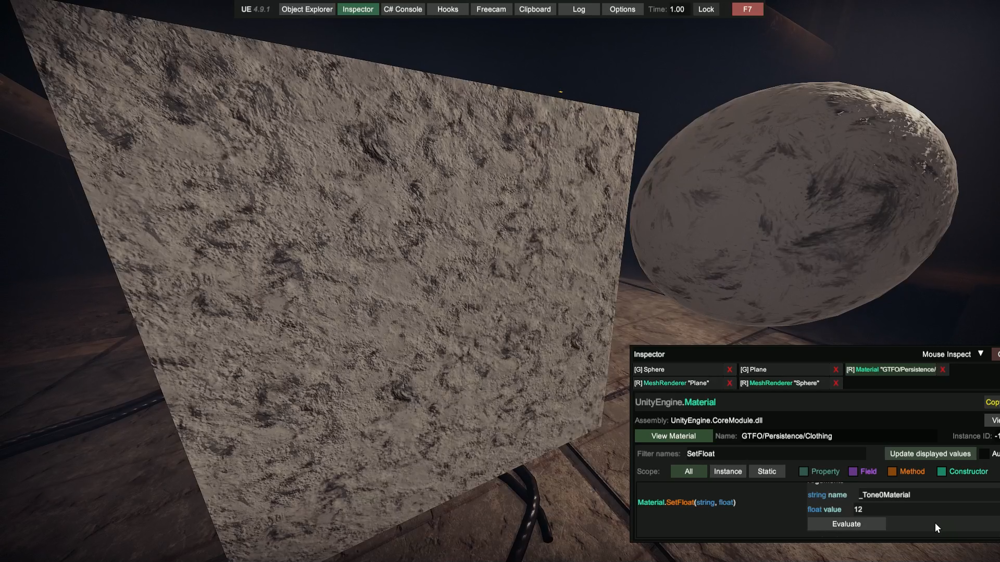
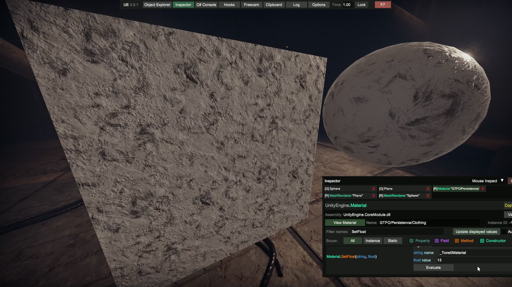
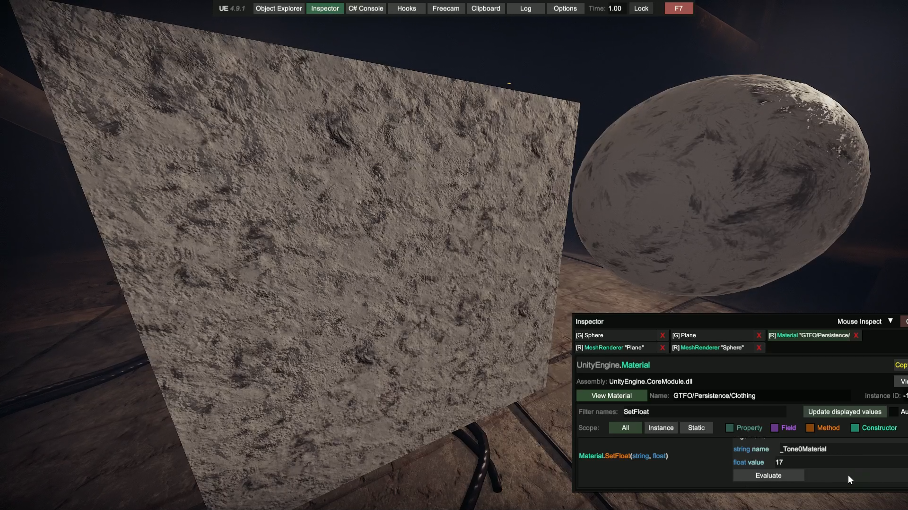

## Clothes Palette Material References

Materials used for the `MaterialOverride` property.

|  ID  | Pattern / Details                        | Reflectivity | Interesting? | Texture Names      |
|:----:|:-----------------------------------------|:------------:|:-------------|:-------------------|
| `0`  | Rough / Fabric like surface              |    🕯️Low    | ❌            | 000_Cotton         |
| `1`  | Vertical stripes                         |    🕯️Low    | ✅            | 005_CottonPattern  |
| `2`  | Very wrinkly clothes / not ironed        |    🕯️Low    | ❌            | 010_Polyester      |
| `3`  | Even rougher / Fabric like surface       |    🕯️Low    | ❌            | 015_Canvas         |
| `4`  | Like 3 but with diagonal stripes         |    🕯️Low    | ✅            | 020_CanvasPattern  |
| `5`  | Double diagonals / X pattern             |    🕯️Low    | ✅            | 025_NylonStrap     |
| `6`  | Carbon fiber-esque pattern               |   ☀️High    | ✅📌          | 030_CarbonFiber    |
| `7`  | Denim-esque surface / diagonal stripes   |    🕯️Low    | ✅            | 035_Denim          |
| `8`  | Very coarse                              |    🕯️Low    | ❌            | 040_VelcroLoop     |
| `9`  | Very coarse, visual horizontal stripes   |    🕯️Low    | ❌            | 045_VelcroHook     |
| `10` | Leather-esque surface                    | 💡Moderate  | ❌            | 050_LeatherFine    |
| `11` | Larger bumps in the surface              |    🕯️Low    | ❌            | 055_LeatherRough   |
| `12` | Minor surface bumps?                     |    🕯️Low    | ❌            | 060_GenericDull    |
| `13` | Minor surface bumps? Plastic?            |   ☀️High    | ❌            | 065_GenericShiny   |
| `14` | Small scratch-like surface imperfections |    🕯️Low    | ❌            | 070_MetalDull      |
| `15` | Idk, looks identical to `13`             |   ☀️High    | ❌            | 075_MetalShiny     |
| `16` | Diamond dot pattern                      |    🕯️Low    | ✅            | 080_PolyesterHoles |
| `17` | Similar to `13` and `15`                 |    🕯️Low    | ❌            | 085_GenericLagom   |
| `18` | 'Standard'                               |    🕯️Low    | ❌            | 090                |
| `19` | 'Standard'                               |    🕯️Low    | ❌            | 095                |

### Images

Images here only for ease of access, opening in external viewer recommended.

📷 Material ID 0

📷 Material ID 1

📷 Material ID 2

📷 Material ID 3

📷 Material ID 4

📷 Material ID 5

📷 Material ID 6

📷 Material ID 7

📷 Material ID 8

📷 Material ID 9

📷 Material ID 10

📷 Material ID 11

📷 Material ID 12

📷 Material ID 13

📷 Material ID 14

📷 Material ID 15

📷 Material ID 16

📷 Material ID 17

